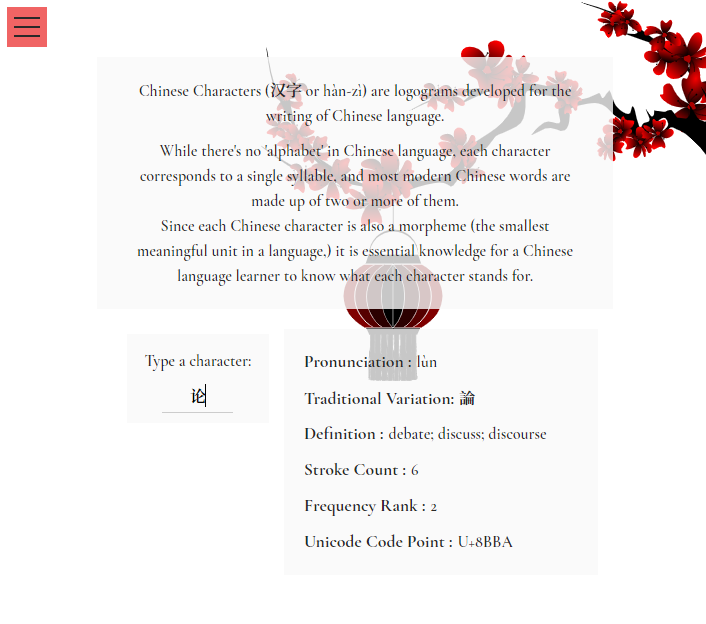

# [HanZi Guide](http://fazeelanizam.com/hanzi-guide)

HanZi Guide is an app which displays basic information about a given Chinese character, such as its pronunciation, definition, number of strokes, frequency rank etc. according to the [Unihan database.](https://unicode.org/charts/unihan.html)



## Getting Started

To find out how to get a copy of the project running on your machine, read on.

### Prerequisites

To check if you have Node.js installed on your machine, open your command line interface and run following command:

```
node –v
```
If the system doesn't display anything along the lines of what you see below,

```
v10.15.1
```
then visit [here](https://nodejs.org/en/download/) and download Node.js, which will include NPM package manager as well, which we're also going to need.  
Download the installation file, click on it and go through the steps to install it.  
You might as well run 'node -v' again this time to verify installation.

### Installing Hanzi Guide

Click the green button 'Clone or download' above, and, either 

* download the repository as a zip,

or

* run

```
git clone https://github.com/fazeelanizam13/hanzi-guide.git
```

Now navigate to the directory where all the files are, copy the path, and run the following command after replacing 'path' with the path you copied:

```
cd path
```
Install the dependencies by running,
```
npm install
```
Run
```
npm start
```
to get the app up and alive!

## Built With

* [ReactJS](https://reactjs.org/)

## Authors

* **Fazeela Nizam** @[fazeelanizam13](https://github.com/fazeelanizam13)

## Acknowledgments

Must mention the following two amazing projects that saved me a ton of time in the process:

* Project [Unihan JSON](https://github.com/dahlia/unihan-json) by **Hong Minhee** @[dahlia](https://github.com/dahlia)

* Project [unihan-etl](https://github.com/cihai/unihan-etl) by **Tony Narlock** @[tony](https://github.com/tony)
